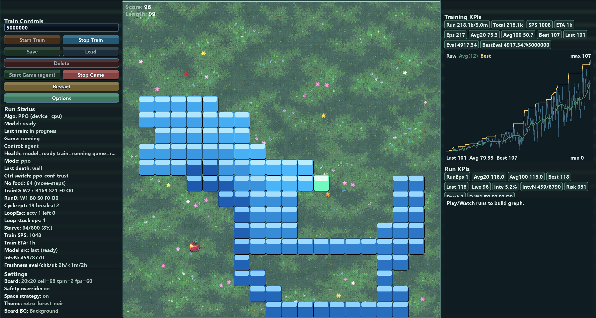

# Self-Learning Snake RL

An interactive Snake RL lab built with `pygame` and PPO.  
The goal is simple: train an agent, watch it play live, measure failures, and iteratively improve behavior with reproducible data.

## What This Demonstrates

- Built a complete desktop ML application with live UI, persistence, and worker-thread training
- Designed regression tooling for worst-case seed analysis and focused debugging traces
- Enforced evaluation discipline with paired holdout runs (PPO-only vs controller-on) and contamination guards
- Implemented learned controller memory (online arbiter + clustered tactic memory) that persists across sessions
- Handled failure recovery for local persisted state with atomic writes and rollback

## Demo

### Live Training UI

Phase 1:

Phase 2:

Phase 3:

## Project Resume

This project is a full training + evaluation environment for reinforcement learning experiments on Snake:

- Learning core:
  - PPO with action masking (`stable-baselines3` + `sb3-contrib`)
  - Gym-style environment (`snake_frame/ppo_env.py`)
- Runtime intelligence:
  - policy inference from PPO
  - dynamic safety/controller arbitration (`snake_frame/gameplay_controller.py`)
  - learned controller memory:
    - `arbiter_model.json` (online learned arbitration)
    - `tactic_memory.json` (clustered tactic memory)
- Experiment loop:
  - train in app UI
  - run holdout suites (`ppo_only` vs `controller_on`)
  - isolate worst seeds
  - capture per-step traces
  - patch and re-validate

## How It Works (For Enthusiasts)

At each game decision:
1. The PPO model predicts an action and confidence.
2. The controller scores local risk (danger, space viability, food pressure, loop signals).
3. The system either trusts PPO or applies controller logic (`escape` / `space_fill` behavior).
4. Outcomes are logged into telemetry and artifacts.

During training:
1. PPO runs in vectorized environments.
2. Evaluation/checkpoints are saved under `state/ppo/<experiment_name>/`. The default baseline path is `state/ppo/v2/`.
3. You can watch live behavior in the same app while training runs.
4. Post-run, focused seed tools identify exactly where controller behavior underperforms.

## Core Features

- Live dashboard with training KPIs, run KPIs, and risk/intervention counters
- Save/load/delete model lifecycle controls in UI
- Determinism and smoke-performance validation tools
- Worst-seed gate + focused per-step trace pipeline for factual debugging
- Clean local artifact model for iterative tuning

## Quick Start (Windows)

1. `setup_env.bat`
2. `run.bat`

Environment defaults:
- Python `3.12`
- Virtual environment at `.venv`
- Locked dependencies from `requirements-lock.txt`

## Reproducibility & Data

After cloning:
1. `setup_env.bat`
2. `run_dashboard.bat` for CI-equivalent validation

Not versioned by design (local experiment data):
- `state/` (local models/checkpoints/UI state)
- `artifacts/` (generated diagnostics/evals/reports)

### Experiment Isolation

- Baseline runs use the default experiment path: `state/ppo/v2/`
- New experiments should use a distinct `experiment_name`
- Before training into the baseline path, preserve both:
  - the baseline model directory under `state/ppo/v2/`
  - the matching suite artifact under `artifacts/live_eval/suites/`

For trustworthy comparisons, cite:
- git commit
- suite artifact (`artifacts/live_eval/suites/suite_*.json`)
- matching `metadata.json`
- experiment name

## Main Controls (In App)

- `Start Train` / `Stop Train`
- `Save` / `Load` / `Delete`
- `Start Game` / `Stop Game` / `Restart`
- Options: adaptive reward, space strategy, themes/backgrounds, debug overlays, diagnostics export
- The settings panel shows the active experiment name so you can see which artifact directory the app is using

## Persistence

Saved artifacts (default baseline path shown):
- `state/ui_state.json`
- `state/ppo/<experiment_name>/*`
- `state/ppo/<experiment_name>/metadata.json`
- `state/ppo/<experiment_name>/arbiter_model.json`
- `state/ppo/<experiment_name>/tactic_memory.json`

By default, the app uses `experiment_name = "v2"`, so baseline runs write to `state/ppo/v2/`.

Metadata captures run IDs, timesteps, configs, provenance, and eval summaries for future tuning.

## Evaluation & Diagnostics

Core artifacts:
- Holdout suite: `artifacts/live_eval/suites/latest_suite.json`
- Focused worst-seed report: `artifacts/live_eval/worst10_latest.json`
- Focused per-step traces: `artifacts/live_eval/focused_traces/<timestamp>_<tag>/seed_<seed>.jsonl`
- Controller gate result: `artifacts/live_eval/controller_candidate_gate.json`

Useful scripts:
- `scripts/worst_seed_gate.py`
- `scripts/focused_controller_trace.py`
- `scripts/post_run_suite.py`
- `scripts/controller_candidate_gate.py`
- `scripts/blind_spot_replay.py`
- `scripts/blind_spot_replay_view.py`

Controller suite contract (automatic):
- `controller_on` summaries now emit:
  - `mean_interventions_pct`
  - `controller_telemetry_rows` (per-seed decisions/interventions/interventions_pct)
- `latest_suite.json` now carries `comparison.mean_interventions_pct` for gate enforcement.

Dashboard acceptance path:
1. Lint
2. Tests
3. Render regression
4. Smoke median perf gate
5. Determinism drift check
6. Controller candidate gate (hard fail on reject)

Blind-spot replay one-shot (Windows):
- `run_blind_spot_replay.bat`
- Generates:
  - `artifacts/live_eval/blind_spot_replay_latest.json`
  - `artifacts/live_eval/blind_spot_replay_latest.html`

## Evaluation Protocol + Current Baseline

Reference date: **March 15, 2026**

Protocol used for comparable controller-vs-PPO checks:
1. Use fixed holdout seeds `17001-17030`.
2. Run paired evaluation with the same model selector (`last`): `ppo_only` then `controller_on`.
3. Keep controller learning disabled during holdout eval (prevents eval contamination/drift).
4. Compare paired seed deltas (`controller - ppo`) and aggregate means.
5. Re-check repeatability on worst-10 seeds from `artifacts/live_eval/worst10_latest.json`.

Current validated baseline (fixed-seed paired run):
- `ppo_only` mean: `56.67`
- `controller_on` mean: `81.27`
- mean delta (`controller - ppo`): `+24.6`
- mean intervention rate (`controller_on`): `3.22%`
- paired seeds: `30` (`9` worse, `18` improved, `3` equal)

Worst-10 repeatability check (controller-on, same seeds run twice):
- run 1 mean: `112.5`
- run 2 mean: `112.5`
- per-seed scores identical across both runs: `true`

Supporting local artifacts (generated during validation, typically not committed):
- `artifacts/live_eval/tmp_ablation/full30_guard099_trust090.json`
- `artifacts/live_eval/tmp_ablation/worst10_ablation_combo.json`
- `artifacts/live_eval/tmp_patch_suite/controller_repeatability_worst10.json`

## Validation Commands (Local)

- Lint:
  - `.venv\Scripts\python.exe -m ruff check snake_frame tests main.py`
- Full tests:
  - `.venv\Scripts\python.exe -m pytest -q`
- Determinism:
  - `.venv\Scripts\python.exe scripts\validate_determinism.py --baseline tests\baselines\deterministic_windows.json`
- Smoke median gate:
  - `.venv\Scripts\python.exe scripts\smoke_gate_median.py --runs 3 --train-steps 2048 --game-steps 300 --ppo-profile fast --max-frame-p95-ms 40 --max-frame-avg-ms 34 --max-frame-jitter-ms 8 --max-inference-p95-ms 12 --min-training-steps-per-sec 250`
- Worst-seed gate:
  - `.venv\Scripts\python.exe scripts\worst_seed_gate.py --suite artifacts\live_eval\suites\latest_suite.json --top-n 10 --enforce --max-worse-count 8 --min-mean-delta -25`

## CI / Automation

GitHub Actions runs fast validation on every push/PR:
- Linting (ruff)
- Unit and integration tests
- Render regression checks

Full ML training/evaluation gates remain local because they are runtime-heavy and hardware-sensitive (CPU-based training, long runtimes, timing-sensitive smoke gates).

Local validation commands are documented above.

## Project Structure

- `main.py`
- `snake_frame/` core app + training + controller modules
- `scripts/` diagnostics/eval/research tooling
- `tests/` automated suite
- `ARCHITECTURE.md` deep architecture notes
